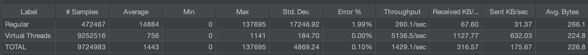

# Virtual Thread Bench

Test repo that sees how the new loom/structured concurrency stuff compares to regular ThreadPool on a servlet.

 # JMX Results

Running a 30-minute JMX test with 4000 threads gives these results. (Running longer seemed futile as regular threads were clearly losing by every metric.)

### Response Time Graph with regular thread pool

With a mere change in a config param, we change the server to execute requests on a virtual thread executor

https://github.com/SentryMan/Virtual-Thread-Bench/blob/6ea8ace8f609533e84611d640232c00cdf1b91d9/src/main/resources/application.properties#L1

### Response Time Graph with virtual thread pool

As expected, virtual threads are amazing

 # Frog
 

